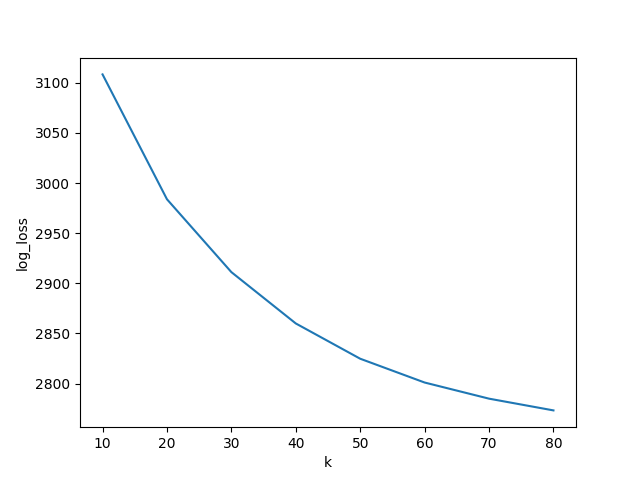
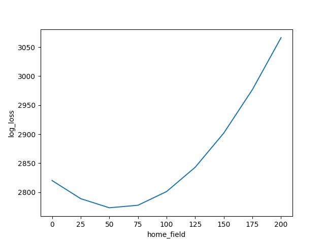
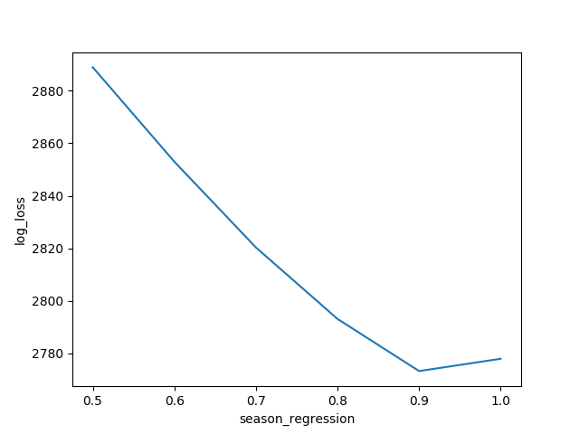
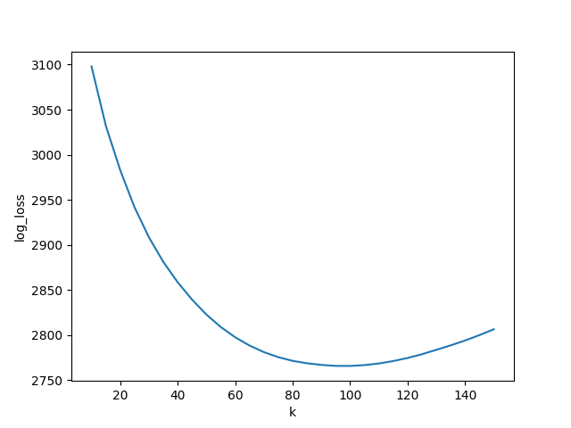
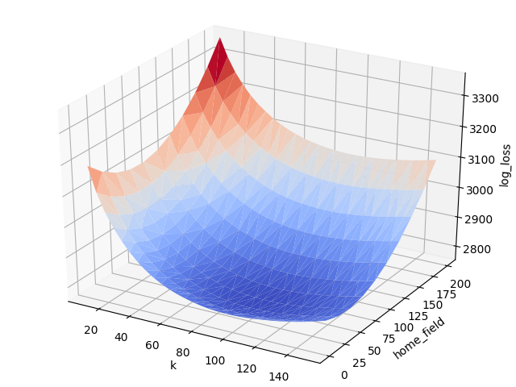
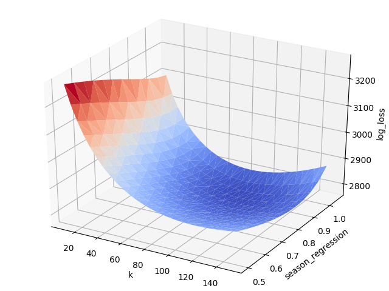
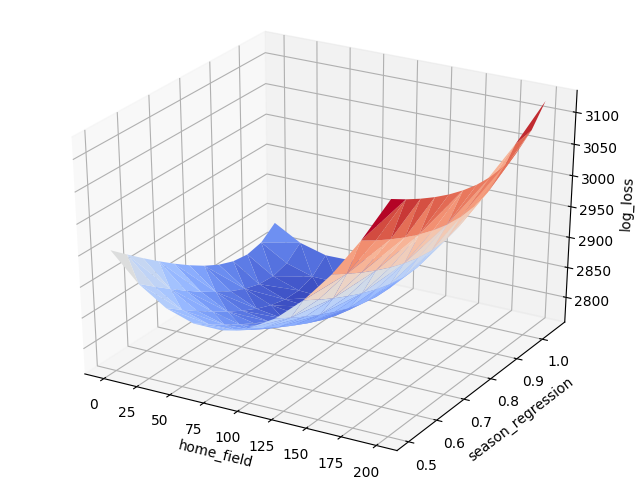
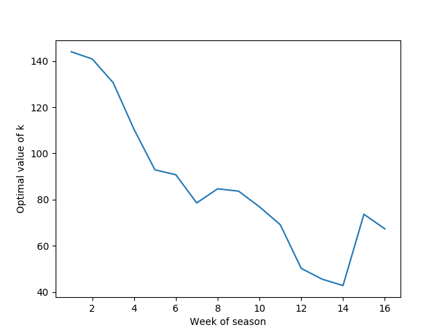

# The question

Which are the best teams in college football?

To answer this question, most people turn to the
[College Football Playoff selection committee](https://collegefootballplayoff.com/sports/2017/10/16/selection-committee.aspx).
(There is also something called the AP poll, but nobody really cares about that.) "The committee," as
it's cryptically known, determines which teams get to play for the national championship and which teams have to
duke it out in the [Beef O' Brady's bowl](https://en.wikipedia.org/wiki/2011_Beef_%27O%27_Brady%27s_Bowl). 
We are told that the committee's integrity is unimpeachable, and that it
carefully considers the resume of each team before making its decision.

But why rely on the committee? This is the twenty-first century, and we have computers and statistics.
Nothing is more objective than a computer making a list. Let's see which teams the computer thinks are best, and
whether there are any surprises.

If you want to skip straight to the [rankings](#the-rankings), please feel free! Most of this README is going to be
about how those rankings were generated, and how you should think about them.

# The Elo system

In order to measure the strength of each team, I decided to use the [Elo system](
https://en.wikipedia.org/wiki/Elo_rating_system). The Elo system is *not* the most powerful method for estimating the
strength of teams. Instead, it's a bit old and crusty. Proposed in 1939 by a Hungarian-American
physics professor who wanted more accurate ratings for chess players, the calculations required
by the algorithm are simple. It was designed by someone who lived in a world without powerful computers or
[Monte Carlo simulations](https://towardsdatascience.com/the-house-always-wins-monte-carlo-simulation-eb82787da2a3).

Elo's biggest weakness is that it throws a lot of information away. In particular, it only looks at the outcomes of
games. It doesn't care about margin of victory, which most college football fans agree is a good measure of
a team's quality. It also doesn't care if an important player was injured during the week at practice, or if the team
is coming off a bye week. If I were training a model to help me make lots of money betting on the outcomes of college
football games, I would want to incorporate all this information.

That having been said, I like Elo for several reasons:

1) It's popular. To this day, it is used in chess competitions, and lots of people know what it is.
2) Because it is used in the chess world, I have an intuition for what the ratings mean, which I like.
3) You, too, can develop an intuition for what Elo ratings mean! If Player A's rating is 200 points higher than
Player B's, then Player A has a ~75% chance of winning. If Player A's rating is 400 points higher,
then Player A has a ~90% chance of winning. Now you have Elo intuition, too.
4) It's easy to program, which is important, because I am going to be programming it.

# The optimization problem

So, how can we create Elo rankings for college football teams?

Most ranking systems, Elo included, are governed by parameters, the correct values for which depend on the activity
that is being ranked. We need to set our parameters carefully if we want our rankings to be meaningful.

## k

The most important parameter in the Elo system is called *k*. *k* measures to what extent we should
update someone's ranking after a win or loss.

Let's imagine that two
teams, the Finches and the Groundhogs, play a game. Initially, both teams have a rating of 1000. It's a close
match, but the Finches pull it out at the last minute. How much should we update each
team's rating? Are the Finches now rated 1001, and the Groundhogs 999? Or are the Finches now rated
1100, and the Groundhogs 900?

If these are baseball teams, and this is the 162nd game of
the season, then we should only make a small update. Each team's Elo rating is based on the previous
161 games. The fact that the Finches beat the Groundhogs doesn't give us much new information, and we shouldn't
dramatically revise our opinion
of either team. We nudge the Finches' rating up a few points, and we take a few points away from the Groundhogs.
This is what it means to use a small value of *k*.

On the other hand, if this is the first game of the football season, then the fact that the Finches beat the Groundhogs
might give us a lot of information. Each team's current rating doesn't represent a prior that we are confident in.
In this case, we should make a bigger update to each of their ratings.

Chess players play a lot of games, and their strength changes gradually over time. For this reason, the governing body
for chess uses a low value of *k*: *k*=20 for most players, and *k*=10 for elite players. Significantly,
*k*=40 is used for players under the age of eighteen. This is because young players improve rapidly,
and their ratings need to be able to update quickly to reflect this.

Do we expect our college football ranking system to have a high or low value of *k*? Anyone who has watched
college football knows the following:

1) Teams often get much better or much worse as the season progresses.
2) The season has at most fifteen games, and the majority of teams only play twelve or thirteen games.
3) Teams can become much stronger or much weaker in the offseason.

For all of these reasons, we should expect to have a high value of *k*.

## Home field advantage

The Elo rating, since it was designed for chess, makes no accommodation for home field advantage, but it's
difficult to imagine how our algorithm could be maximally effective without being aware of it.
Home field makes a difference in college football. Teams often have much better home records than road records.

To wedge this into the Elo system, we will create a new parameter called *home_field*. Returning to our
previous example, let's imagine that the Finches played the Groundhogs at home. Previously, we said that both teams had
a rating of 1000. But now, to account for the fact
that the Finches are playing at home, we increase their expected strength by *home_field* points. If
*home_field*=200, then we pretend as though the Finches are rated 1200. The Groundhogs retain their old rating of 1000.
We then predict that the Finches have a ~75% chance of winning.

## Regression to the mean between seasons

One final, important difference between college football and chess is that every year in college football, the team
transforms in the offseason. Some years, a team gets a lot better; other times, it gets a
lot worse. In general, though, we should expect some [regression to the mean](https://en.wikipedia.org/wiki/Regression_toward_the_mean).
(We have all been waiting for Alabama to regress to the mean for a long time...) I will account for this with a parameter
called *season_regression.*

It works like this: if a team's strength is 1500 at the end of the season, and the average
strength of a team in the league is 1000, then I adjust the team's strength as follows in the offseason:

1000 + (1500-1000) * *season_regression*

If a team is weaker than average at the end of the season, then I adjust it toward the mean in the same way. Let's consider a team
with a ranking of 700.

1000 + (700-1000) * *season_regression*

## Our objective function

I have left out the most important element in our optimization problem. What variable are we trying to maximize or
minimize?

Qualitatively, we are trying to minimize the error of our model's predictions. If the model says that Team A has a 99%
chance of beating Team B, and Team B wins, that is bad. We want that to happen as rarely as possible.

We can make this goal quantitative in the following way. Let's train our model over several seasons of college
football results. We will feed each result into our model and ask it to assign a probability to the result. The best
model will be the one that maximizes the product of those probabilities. In statistics,
this is called [maximum likelihood estimation](https://en.wikipedia.org/wiki/Maximum_likelihood_estimation).

I like maximum likelihood estimation because it rewards our model for being confident. If the model says that the
Finches have a 90% chance of beating the Groundhogs, and the Finches win, that's great! But we prefer a model that
assigns a 95% chance of beating the Groundhogs, or a 99% chance, and gets it right.

Here is how maximum likelihood estimation will work for our use case.
I have access to [ten years of college football results](scores.csv), from 2010 to 2019. I will
begin by giving every team an Elo ranking of 1000, and I will choose some values for *k*, *home_field*, and
*season_regression*. Then I will start feeding scores into my model. I will ask it to predict the outcome of each
contest, and the model will give me a probability. The product of all those probabilities is the quality
of the model.

If we are choosing between two models, or two sets of parameters, then we choose the one that is
"surprised" less often. To put it another way, a good model matches the data.

Because every team starts with a rating of 1000, our model will be terrible at predicting the outcome of games in the
early years, and will take a while to "right" itself. For this reason, I ignore the probabilities that it assigns
to games between 2010 and 2012.

I also ignore the probabilities that it assigns to games in 2019, for a more subtle reason. I am hoping to measure the
quality of my model by looking at how effectively it ranks teams in 2019. If I train
my model using the data from this season, then I am giving it an unfair advantage. I would be "fitting" my model's
parameters to the data that I want to use to determine if the model is good. For more on this, see [the difference
between training, validation, and test sets.](https://en.wikipedia.org/wiki/Training,_validation,_and_test_sets) The

# Actually solving the problem

## Grid search

How can we optimize the values of *k*, *home_field*, and *season_regression*?

Well, there are different strategies for doing this. Fortunately, because we only have three variables to optimize over,
a simple approach is open to us called [grid search](https://towardsdatascience.com/grid-search-for-model-tuning-3319b259367e).

It works like this. First, we define "reasonable ranges" for each of the three variables. Based on what
we know from chess, a reasonable value for *k* is between 10 and 80. *home_field* should be between 0 and 200, and
*season_regression* should be between 0.5 and 1. Next, we scan across all three variables and consider all
possible combinations at a fixed, coarse resolution.

Grid search is not efficient. If you're trying to optimize a model with dozens or hundreds of parameters, it
simply doesn't work. There are too many combinations to consider. But, since we're lucky to have just three variables,
grid search is open to us. And it has some great advantages!

1) It is dead simple to implement.
2) It produces graphs that help us gain intuition for what we're trying to optimize.

What kind of graphs? I'm glad you asked! Here is how the log loss varies as a function of each of our three variables.
(Log loss is the technical term for the quantity that we are trying to minimize. You can think of it as how surprised
the model is by the results of the games.)

The second and third graphs are what we expect to see. A good value for *home_field* is around 50, and a
good value for *season_regression* is around 0.9. If we deviate in either direction, the model loses predictive power.

The first graph is surprising, though, because the optimal value for *k* is all the way over on the right. This means
that our initial "reasonable" range for our grid search--from between 10 and 80--was not wide enough! If we
allowed our optimizer to choose a value of *k* that was even higher than 80, then we might be able to improve our
model further.

This surprised me! I didn't expect the optimal value of *k* to be more than four times greater than the value of
*k* used in chess.

Let's rerun our grid search at a higher resolution, and with a "reasonable range" for *k* of between 10 and 150.

Now the first graph is the same shape as the others! Our optimal value for *k* is around 100.

Let's look at some fancier graphs, to consider how the log loss varies as *two* parameters change jointly.

Each of these graphs is [*convex*](https://www.solver.com/convex-optimization), or "bowl-shaped." This is important
because convex functions are easy to optimize, and there are lots of out-of-the-box solvers that do it. You just
need to find the point at the bottom of the bowl.

The best parameters discovered by grid search were:

{*k*: 100, *home_field*: 60, *season_regression*: 0.9}

The log loss at this point is 2765.68.

## Gradient descent

Now that we have a good guess for the optimal values of our parameters, we can refine
them further with [gradient descent](https://ml-cheatsheet.readthedocs.io/en/latest/gradient_descent.html).

I am not going to try to explain how gradient descent works. There are lots of good explanations online, including
in the link that I chose! But basically, the idea is that we take small steps down the slope of our objective function
until we arrive at the bottom. This is a local minimum.
Because the function that we are trying to optimize is convex, we will also know that it is the
[global minimum](https://math.stackexchange.com/questions/1591520/what-is-difference-between-maxima-or-minima-and-global-maxima-or-minima),
and the best parameters that we can possibly find.

Here are those optimal parameters:

{*k*: 96.66, *home_field*: 54.55, *season_regression*: 0.92}

The log loss at this point is 2764.81.

The grid search, despite its simplicity, found a set of parameters that was pretty close to optimal!

## Allowing k to vary across weeks

Before we reveal the best teams in college football according to our model, there is one more thing that I want to try.

Thus far, we have used the same value of *k* to update our ratings after every week of the college football season.
This seems suboptimal. Early in the season, when we know less about the true quality of teams, we should expect to make
bigger updates to their ratings. Later in the season, assuming that we have discovered "true" ratings, the magnitude of
the updates should shrink.

What if we allowed the value of *k* to vary over the course of the season?

This would mean that, instead of optimizing over three parameters, we would optimize over eighteen parameters. We will
still have *home_field* and *season_regression*, but we'll also have a separate value of *k* for each of the sixteen
weeks of the college football season: *k1* for Week 1, *k2* for Week 2, and so on.

(Yes, sixteen is the correct number. Twelve games + two bye weeks + the conference championship + the bowl game.)

If we want to optimize a function with eighteen parameters, grid search is no longer a viable option. We can't do
a combinatorial search over eighteen variables. Fortunately, gradient descent is still up to the task!

Here are the optimal values of *k*, if we allow *k* to vary throughout the season:

This mostly matches our intuition! In the early games, we should make big updates to the estimated
strength of each team. This allows our model to quickly "correct" for any turmoil or team-building 
in the offseason. By the time that we reach week 5, our estimate of the "strength" of each team has stabilized,
and the optimal value of *k* drops. It continues to decline until week 14, which is the last
week of the regular season. Our model is 3x more sensitive to the results of games at the beginning of the season than
at the end of it.

Something interesting happens in weeks 15 and 16--the conference championship and the bowl game. The optimal value of
*k* is higher for these weeks than at the end of the regular season. Why?
My guess is that these games receive a bigger "weight" because they provide more
information about the "true strength" of teams than a random game at the end of the regular season. In the conference
championship, we get to see high-quality teams play each other. In the bowl game, teams from *different*
conferences play each other, which is especially useful to help our model to calibrate itself.

When we allow *k* to vary, our log loss drops from 2764.81 to 2731.22. The difference isn't transformative, but the
model probably becomes somewhat better.

# The rankings

Here are the top 25 teams at the end of the 2019-2020 season, according to my model. I've also included each team's Elo
ranking, and how that team's ranking compares to where it finished in the poll.

1) LSU (1789) (+0)
2) Clemson (1765) (+0)
3) Alabama (1697) (+5)
4) Ohio State (1680) (-1)
5) Georgia (1606) (-1)
6) Oklahoma (1564) (+1)
7) Notre Dame (1549) (+5)
8) Florida (1522) (-2)
9) Penn State (1520) (+0)
10) Oregon (1519) (-5)
11) Michigan (1466) (+7)
12) Auburn (1425) (+2)
13) Minnesota (1420) (-3)
14) Iowa (1418) (+1)
15) Wisconsin (1406) (-4)
16) Texas A&M (1391) (not included in poll)
17) Utah (1389) (-1)
18) Texas (1377) (+7)
19) Memphis (1371) (-2)
20) Cincinnati (1370) (+1)
21) Appalachian State (1369) (-2)
22) Boise State (1368) (+1)
23) Baylor (1364) (-10)
24) UCF (1362) (+0)
25) Washington (1342) (not included in poll)

I will leave it to readers to evaluate the quality of these rankings! I do think that they pass a basic sanity check,
though. I was relieved to see the national champion and runner-up at the top.

The model groups LSU, Clemson, Alabama, and Ohio State into an elite class of teams.
Notice how their ratings are significantly higher than Georgia's, and how Georgia's is significantly
higher than a tightly clustered group of schools (Oklahoma,
Notre Dame, Florida, Penn State, Oregon). The pollsters punished Alabama for a close loss to Auburn at home,
but come on...does anyone really believe that Alabama is only the eighth-best team in the nation?

Another team that leaps out to me on this list is Baylor, which my model thinks is overrated. The reason for this
is clear to me...Baylor's schedule isn't very good. My model cares a lot about strength of schedule. Wins against
bad opponents barely increase a team's rating at all. My model is also unsympathetic to teams that suffer
close losses, and Baylor had two close losses to Oklahoma. A more sophisticated model would consider margin of victory.

Finally, I'd like to point out that my model believes that Notre Dame is underrated. Believe it or not,
this pleasing result was not engineered by me in any way. :)
